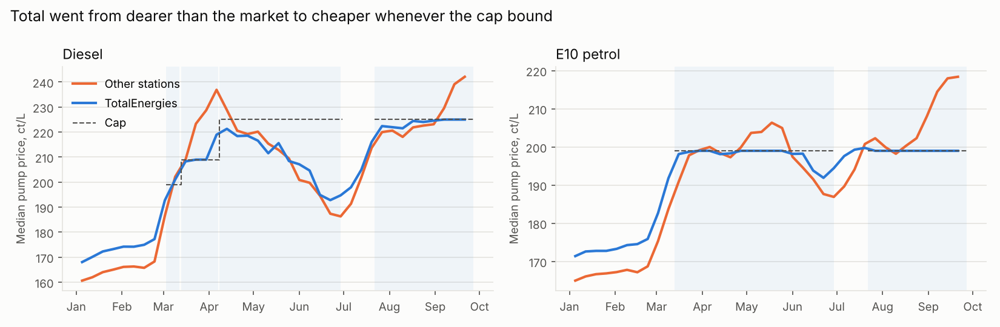
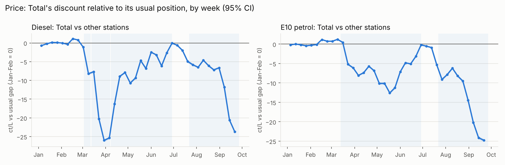
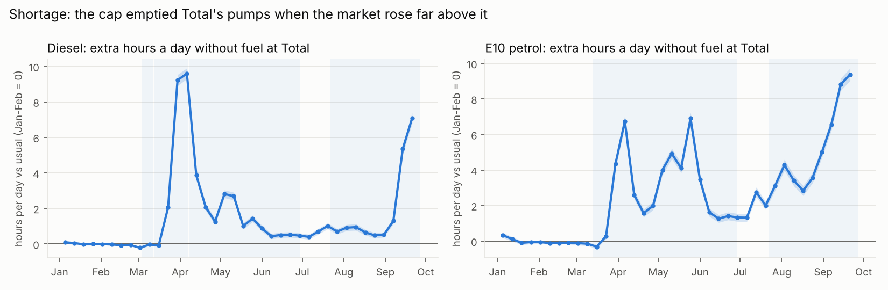
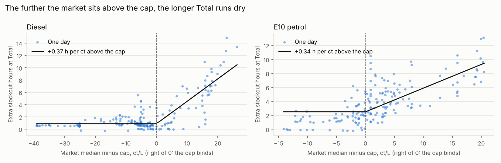
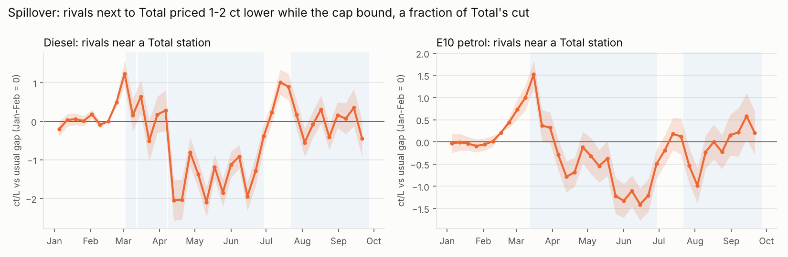

# Fuel Pricing Lab

What happens when a fuel retailer caps its own prices in a price shock? Who gains, and what does it break?

In March 2026 an oil price shock pushed the median French diesel price from 1.66 to 2.29 €/L in five weeks. TotalEnergies responded with a **voluntary price cap** at its roughly 3,300 stations in mainland France: 1.99 €/L for petrol, and 1.99, then 2.09, then 2.25 €/L for diesel. It switched most of the cap off on 30 June and back on from 22 July. Competitors had no cap.

This project measures the cap from **every price change at every French station** between January and September 2026: 9,583 stations and 2.5 million station-days for diesel. It uses the government's open data feed, which also records each time a station runs out of a fuel.



## Findings

**1. Total went from the dearest network to the cheapest.**
- In January and February, the median Total station was **8 ct/L dearer** than the median rival on diesel, and **6 ct dearer** on E10.
- With the cap binding, Total was up to **26 ct/L cheaper than its usual position** on diesel (week of 30 March), and **25 ct** on E10 (late September).
- Averaged over the weeks the cap bound, the discount was **17 ct** on diesel and **11 ct** on E10.
- 87% of Total stations sat exactly on a cap value on those days, against 3% of other stations.



**2. The cap emptied Total's pumps.**
- Before the shock, a Total station was out of diesel about **0.1 hours a day**.
- In the week of 6 April, with the market 17 to 20 ct above the cap, Total stations were out of diesel **9.6 extra hours a day**, about 40% of the day.
- The same thing happened on E10 in late September (+9.4 h/day), when the market rose 19 ct above the 1.99 € cap.
- Rival stations saw almost no change.



**3. Shortages scale with how far the market sits above the cap.** Each cent the market sits above the cap adds **0.37 hours** of diesel stockout a day at Total (90% CI 0.24 to 0.45), and **0.34 hours** for E10. Below the cap there is almost no extra stockout. This is the textbook prediction for a binding price ceiling, measured station by station in real data.



**4. Rivals barely moved.**
- From mid-April to June, rivals within 1 km of a Total station priced about **1.5 ct lower** on diesel than rivals more than 5 km away, under a tenth of Total's own cut.
- In September, when Total ran dry, the gap disappeared. An empty pump exerts no price pressure on its neighbours.



**5. For drivers, the shortage ate about half of the saving at the peak.** A Monte Carlo compares driving to the Total station with going straight to the nearest rival. A wasted trip costs extra kilometres and time.
- In the week of 6 April, a 50-litre fill at Total saved about **€13 if fuel was there**.
- The pump was empty 42% of the time, so the expected gain was **€5.5**, and the trip paid off in only **58%** of draws.
- In most other capped weeks, the trip paid off more than 85% of the time.

**6. The cap cost TotalEnergies an estimated €460 million** (90% interval €280 to €640 million) from March to September. Station volumes are not public, so this rests on stated assumptions (2 to 5 million litres per station per year) and is the least certain number here.

Full tables: [reports/cap/results.md](reports/cap/results.md).

## Method

```
PrixCarburants_annuel_2026.xml        every reported price and stockout, about 9,800 stations (open data)
  -> load.parse_fr_xml / parse_fr_stockouts   stream the 330 MB XML into flat files
  -> daily.summarise                  posted price as a step function: time-weighted daily mean,
                                      min/max, increases and cuts, hourly profile
  -> load.read_osm_brands             brand of each station from OpenStreetMap (ref:FR:prix-carburants tag)
  -> cap.first_stage                  is the cap visible? share of stations priced exactly at a cap value
  -> cap.gap_study                    Total vs others by week, station and week fixed effects
  -> cap.stockout_dose                extra stockout hours against market-minus-cap, weekly block bootstrap
  -> cap.spillover                    rivals <= 1 km from Total vs > 5 km, same design
  -> cap.driver_mc, cap.cost_mc       Monte Carlo for drivers and for TotalEnergies
```

Design choices that matter:

- **The treatment group is defined without looking at prices.** Total stations come from OpenStreetMap brand tags, matched on the government station id. 9,694 of 9,769 stations match. The share of stations priced exactly at a cap value then serves as a check, not as the definition: 87% of the tagged Total stations sit there on binding days, against 3% of the rest.
- **Every comparison is relative to Total's usual position.** Total is normally 6 to 8 ct dearer than its rivals, so a raw "Total vs rivals" gap understates the cap. The event study removes station and week effects and re-centres on January and February. In those weeks the coefficients stay within about ±1 ct, against effects of 25 ct.
- **The posted price is a step function.** A daily mean of reported prices would over-weight stations that change price often. The panel uses the price in effect each second of the day.
- **Stockouts come from the stations' own reports** of a temporary rupture, measured in hours per day.

## How it was validated

20 automated tests, all on synthetic data with a known answer:
- the time-weighted daily mean, the carry-over of prices across days without reports, and the counting of increases;
- the fixed-effects estimator against a dummy-variable regression, for both coefficients and clustered standard errors;
- a weekly panel with a planted 15 ct discount, which `gap_study` recovers within 0.4 ct, with a flat pre-period;
- a planted stockout slope of 0.4 h/ct, which `stockout_dose` recovers within 0.03;
- stockout episodes split across midnight, and brand classification;
- the readers for both national feeds.

## Limitations

- **The counterfactual is Total's usual premium.** If the premium would have changed by itself during a shock, part of the gap is not the cap. In the calm weeks it moves by about one cent.
- **Brand tags are from OpenStreetMap in October 2026.** Untagged Total stations sit in the control group: 3% of "others" price exactly at a cap value. This pulls the estimates towards zero.
- **The cap calendar comes from press releases.** The first diesel cap (1.99 €) predates the 12 March release, so its start is dated from the data. Two episodes are not modelled: the cap kept at about 1,200 rural stations between 30 June and 21 July (the list is not public), and the motorway weekend prices.
- **Stockouts are self-reported.** Total stations reported slightly more stockout hours before the shock (0.12 vs 0.06 h/day on diesel), and the analysis compares changes, not levels.
- **The spillover has a pre-trend.** Rivals near Total rose about 1 ct relative to far ones in early March, before the cap bound. Part of the April dip may reverse that.
- **No volumes.** The cost to TotalEnergies and the driver simulation rest on stated assumptions, varied in the Monte Carlo.

## Part 2 (in progress): Germany's 12:00 rule

From 1 April 2026, German stations may raise prices only once a day, at noon. The same pipeline handles the German feed (Tankerkönig / MTS-K, every price change at about 15,000 stations). `fuellab.noonrule` then estimates three things against France as a control: the level effect, the change in the daily price cycle, and what the hour of filling up now costs. It is tested on a synthetic market with a known effect (`tests/test_identification.py`), and will run once the data access is granted.

## Run it

```bash
pip install -e ".[dev]"
# download PrixCarburants_annuel_2026.zip (see data/README.md) and unzip into data/raw/
python -m fuellab.pipeline aggregate-fr --raw data/raw/PrixCarburants_annuel_2026.xml   # about 5 minutes
python -m fuellab.pipeline cap                                                          # tables, figures, results.md
pytest -q
```

```
src/fuellab/   load, daily, fe (fixed effects in numpy), cap (part 1), noonrule (part 2), report_cap, pipeline
tests/         20 tests on synthetic data with known answers
reports/cap/   results.json, results.md, weekly tables, figures
data/          OSM brand file (committed); raw feeds are downloaded, see data/README.md
```

## Data

- Prix des carburants en France, Ministère de l'Économie, annual file 2026, Licence Ouverte 2.0: https://donnees.roulez-eco.fr/opendata/annee/2026
- Fuel stations with brand tags: © OpenStreetMap contributors, ODbL, exported with Overpass.
- Cap dates and levels: TotalEnergies press releases of 12 March, 31 March, 27 May, 30 June and 22 July 2026.

MIT licence for the code.
